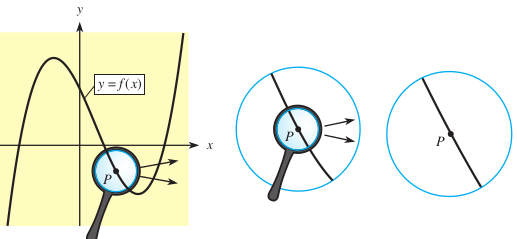
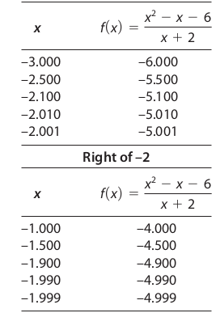

```{r setup, include=FALSE}
library(knitr)
library(rmdformats)

## Global options
options(max.print="75")
opts_chunk$set(echo=TRUE,
	             cache=TRUE,
               prompt=FALSE,
               tidy=TRUE,
               comment=NA,
               message=FALSE,
               warning=FALSE)
opts_knit$set(width=75)
```

## **Background**
If a firm receives Ksh. 30,000 in revenue during a 30-day month, its average revenue per day is $\frac{30,000 Shillings}{30 Days}$ = Ksh. 1000 per day. This does not necessarily mean the actual revenue was Ksh. 1000 on any one day, just that the average was Ksh. 1000 per day. 

Similarly, if a person drove 50 kilometers in one hour, the average velocity was 50 kilometers per hour, but the driver could still have received a speeding ticket for traveling 70 kilometers per hour. Maybe in some places the driver did 20 kilometers per hour and 100 kilometers per hour in other sections. The 50 km/hr is just an average. 

However, the smaller the time interval, the nearer the average velocity will be to the instantaneous velocity (the speedometer reading). Similarly, changes in revenue over a smaller number of units can give information about the instantaneous rate of change of revenue.

The mathematical bridge from average rates of change to instantaneous rates of change (change at a point in time) is the limit. This chapter is concerned with limits and rates of change. We will see that the derivative of a function can be used to determine instantaneous rates of change. 

## **The Concept of the Limit**

>Let f (x) be a function defined on an open interval containing c, except perhaps at c. Then, 

> > $\lim_{x \to c} f(x) = L$

>is read “the limit of f (x) as x approaches c equals L.” The number L exists if we can make values of f (x) as close to L as we desire by choosing values of x sufficiently close to c. When the values of f (x) do not approach a single finite value L as x approaches c, we say the limit does not exist.

***Example 1***: 

You are given the following function. 

$f(x) = \frac{x^2 - x - 6}{x + 2}$

We know the domain is every other number in the number line except -2. What happens to the equation when you have x = -2? 

We know that $x = -2$ is not in the domain of $f(x)$, so $f(-2)$ does not exist even though f(x) exists for every other value where $x \neq 2$. The Graph below shows the graph of $y = f(x)$ with an open circle where $x = -2$. The open circle indicates that $f(-2)$ does not exist but shows that points near $x = -2$ have functional values that lie on the line on either side of the open circle. 







Even though $f(-2)$ is not defined, the figure shows that as x approaches -2 from either side of -2, the graph approaches the open circle at (-2, -5) and the value of $f(x)$ or y approaches -5. Thus, -5 is the limit of $f(x)$ as x approaches -2. 

As x gets closer and closer to -2 (Note that it can never be -2 as that point is undefined), the value of $y = f(x)$ gets closer and closer to -5. Hence,

$\lim_{x \to -2} \frac{x^2 - x - 6}{x + 2} = -5$

***Example 2***

We have already looked at $e$ that we called the natural number. The natural number is defined as a limit of;

$(1 + \frac{1}{n})^n$

As $n$ tends to infinity.

$\lim_{n \to \inf}(1 + \frac{1}{n})^n = e = 2.718......$

## **Differentiation**

We illustrate the concept of differentiation using the concept of limits to compute the rate of change in velocity in the example below. 

***Example***

Suppose a ball is thrown straight upward so that its height $f(x)$ (in feet) is given by the equation;

$f(x) = 96 + 64x - 16x^2$

Where x is time (in seconds).

- Find the average velocity from x = 1 to x = 5.

- Find the average velocity from x = 10 to x = 20

- Find the average velocity from x = 1 to x = 1 + h.

- Find the instantaneous velocity at x = 1.

***Solutions***
- For the first case, the solution is by getting the velocity at x = 5 then subtract the velocity at x = 1. 

At x = 5, we have $average velocity = 96 + 64(5) - 16(5^2) = 16$

At x = 1, we have $average velocity = 96 + 64(1) - 16(1^2) = 144$

hence the velocity is $16 - 144 = -128$ meaning the ball was reducing speed as it moved upwards as we would expect. 

- For the second case, the solution is by getting the velocity at x = 20 then subtract the velocity at x = 10. 

At x = 5, we have $average velocity = 96 + 64(20) - 16(20^2) = -5024$

At x = 1, we have $average velocity = 96 + 64(10) - 16(10^2) = -864$

hence the velocity is $-5024 - - 864 = -4160$ meaning the ball was reducing speed as it moved upwards as we would expect.

- For the second case, the solution is by getting the velocity at x = (1 + h) then subtract the velocity at x = 1. 

At x = 5, we have $average velocity = 96 + 64(1 + h) - 16(1 + h)^2$

At x = 1, we have $average velocity = 96 + 64(1) - 16(1^2) = 144$

Hence the velocity is $32 - 16h$.

Thus, we can use the formula $32-16h$ to determine the velocity of the ball at any height.  

- The instantaneous velocity V is the limit of the average velocity as h approaches 0.

$\lim_{h \to 0}(32 - 16h) = 32m/s$

Meaning the ball leaves the ground (where h is approximately zero) at 32m/s and also hits the ground (again the height is zero) at 32m/s. The idea here is that by getting the difference between the speed at two points, we can get a way to compute average velocity at many other points. 

Watch some additional videos on limits as they are an important concept in future classes. 

If `f` is a function defined by $y = f(x)$, then the derivative of $f(x)$ at any value x,

$f'(x) = \lim_{h \to 0}\frac{f(x + h) - f(x)}{h}$

if this limit exists. If `f'(c)` exists, we say that f is differentiable at c

Here, we see that as h gets smaller and smaller, then f(x + h) gets closer and closer to f(x) meaning that the line connecting the two points gets approximately straight. 


## **Rules of Differentiation**

In this section, we examine the rules of differentiation with examples. 

### The power rule

$\frac{dy}{dx}x^n = nx^{n -1}$

Example: 

Find the derivatives of the following functions (with respect to x). 

- $y = x^2$
- $y = x^4$
- $y = 4x^3$
- $y = 2$
- $y = c$
- $y = 3x^5 + 4x^2 + 1$

Solutions: 

- $\frac{dy}{dx}x^2 = 2x^{2 -1} = 2x$

- $\frac{dy}{dx}x^4 = 4x^{4 -1} = 4x^3$

- $\frac{dy}{dx}4x^3 = 3*4x^{3 -1} = 12x^2$

- $y = 2$ can also be written as $y = 2x^0$. Remember, $x^0 = 1$. Hence, 
We get the derivative of $y = 2x^0$. 

$\frac{dy}{dx}2x^0 = 0x^{0 -1} = 0$

As a rule, the derivative of a stand alone constant is zero. 

- $y = c$, again $\frac{dy}{dx}cx^0 = 0c^{0 -1} = 0$

To emphasize, the derivative of a constant that has no x attached to it is ALWAYS zero. 

It is possible to be confused with for instance $y = 2x^3$. Note that the 2 in this case is not a constant as it is attached to x. Hence, the derivative will be $6x^2$. 

- $y = 3x^5 + 4x^2 + 1$. In this case we can break the equation into parts as follows. 

$y' = \frac{dy}{dx}3x^5 + \frac{dy}{dx}4x^2 + \frac{dy}{dx}1$

Hence, we get;

$y' = 15x^4 + 8x$

Note that in many occasions the derivative of y with respect to x is written as y'.

Exercises: 

Find the derivative of the following functions; 

- $y = 3x^2 + 2x + 11$

- $y = 9 - \frac{1}{2}x^2$

- $y = -x - 1$ 

Note the way the derivative notation $\frac{dy}{dx}$ is similar to the formula for getting the gradient of a straight line $\frac{\Delta Y}{\Delta X}$. The idea of the derivative is the same, it gives the gradient of a curve at a given point. Thus, once you get the derivative, you can plug in a value of x to get the slope of the curve at that point. In fact, the greek letter $\Delta$ is the upper case version of $\delta$ (just like we have A and a). The pronunciation is delta. 

Using each of the above derivatives, find the gradient or rate of change at the point x = 2. 

### The product rule

What happens when we have a function that has two parts multiplied together, for instance $y = (x + 1)(3x^2 + x)$

The product rule comes handy. You hold the first part of the function constant and then differentiate the second part. You then hold the second part constant and differentiate the first. Then, you add the two derivatives together As follows

$y' = (x + 1) \frac{dy}{dx}(3x^2 + x) + (3x^2 + x) \frac{dy}{dx}(x + 1)$

$y' = (x + 1)(6x) + (3x^2 + x)(1)$ = $6x^2 + 6x + 3x^2 + x$ = $9x^2 + 6x + 2$

Note that you could also opt to multiply the two parts of the function $y = (x + 1)(3x^2 + x)$ together first and then take the derivative. You should still get the same answer. 

Exercises: Use the product rule to get the derivatives of the following functions. You could also confirm your answer by multiplying the two parts together and then getting the derivative at once. 

- $y = (3x^2)(2x)$

- $y = (5x^4 + 3x^4)(2x + 1)$

Again, get the rate of change for each of the functions at x = 2. 


### The quotient rule

What about occations where we have a division, for instance $y = \frac{x^2}{x + 1}$? Th quotient rule allows us to get the differential. 

The easiest way to remember the quotient rule is to denote the numerator as `u` and the denominator as `v` and the differentiation with `d`. 


$\frac{dy}{dx}\frac{u}{v}$ = $\frac{vdu - udv}{v^2}$

In other words, you first hold v(the denominator) constant then differentiate the numerator(u). Then, hold u (the numerator) constant then differentiate the denominator(v). You subtract these two and then divide by the denominator squared ($v^2$). Lets try an example. 

- Differentiate the following function. 

- $y = \frac{x}{x + 1}$
- We first leave the denominator (v) constant and differentiate the numerator. 

$(x + 1)\frac{dy}{dx}x = (x + 1)$

- We then hold the numerator constant and differentiate the denominator.

$(x)\frac{dy}{dx}(x + 1) = x$

- Then we subtract the two and divide everything with denominator squared ($v^2$). 

$\frac{(x + 1) - x}{(x + 1)^2} = \frac{1}{(x + 1)^2}$


- Differentiate the function $y = \frac{1}{x}$

- Differentiate the function $\frac{4x^2}{x+1}$

- In each of the above cases, find the instantaneous rate of change at x = 5. 
 
### The chain rule

In some cases, you are given a composite function like $y = (x + 1)^2$. 

We can try and expand this one and get the derivative. 

$y = x^2 + 2x + 1$, which, when diferentiated becomes $y' = 2x + 2$. 

We could have used the chain rule instead of expanding!! 

First, we differentiate the whole function as is and then multiply by the differential of the components inside the function. 

Differentiating the whole function gives

$2(x + 1)^1) = 2x + 2$

The differential of the inner part $(x + 1)$ is 1. Then we multiply the two.

we get $y' = 2x + 2$


## Differentiating Special Functions (log, exponentials, etc)

### Logarithmic functions

We start with natural logs. remember natural log is log to base $e$, that natural number. 

$\frac{dy}{dx}ln(u) = \frac{u'}{u}$, where u' is the differential of the u part. 

$x' = \frac{dy}{dx}x = 1$, hence, $\frac{dy}{dx}ln(x) = \frac{1}{x}$


Example: What is the differential of the following function. 

- $y = ln(x^2)$?

Note here the x part is $X^2$. We know that $\frac{dy}{dx}ln(u) = \frac{u'}{u}$. 

We first differentiate the $x^2$ to get $2x$. 

Then, we divide this with the $x^2$, to get $\frac{dy}{dx}(x^2) = \frac{2x}{x^2}$

- $y = ln(3x^2 + 5)$

- $y = ln(2x)$

Find more explanations on this [link](https://www.youtube.com/watch?v=Dp9sgIvaKPk) or copy and paste <https://www.youtube.com/watch?v=Dp9sgIvaKPk>. 

### Exponential Functions

see this [link](https://www.youtube.com/watch?v=zmnh448y_ZU) or copy and paste the following <https://www.youtube.com/watch?v=zmnh448y_ZU>. 

Generally, the derivative of $e^u$ is $e^u * u'$, where $u'$ is the differential of $u$. For example, what is the derivative of; 

Example:

$y = e^x$, we want $\frac{dy}{dx}e^x$,

- We hold $e^x$ constant, then multiply with the differential of x. 

$e^x\frac{dy}{dx}x = e^x$; This is an important principal that the differential of $e^x$ remains $e^x$. 


Example:

What is the differential of:

$y = e^{2x}$

we want $\frac{dy}{dx}e^{2x}$, so first we hold the whole $e^{2x}$ constant and then differentiate the $2x$ and then multiply the two. 

$\frac{dy}{dx}e^{2x} = e^{2x}.\frac{dy}{dx}2x = 2e^{2x}$.

Exercises

Get the derivatives of:

$y = e^{-x}$, notice the negative here. 

$y = e^{5x}$

$y = 2x + e^{3x}$, here you also use the previous knowledge. 

$y = 3x^2 + e^{-3x} + log(2x)$, again here you use some of the previous knowledge. 

## **Applications of Differentiation**

### Getting the maximum, minimum or inflection point of a curve

Example: Given the quadratic function;

$y = x^2 + 2x + 1$, determine the turning point or points of the curve. 

determine whether this point is the maximum or minimum. 

Solution: 

NB: At the turning point, the gradient is zero. We have noted that the derivative represents the gradient at a given point.

$\frac{dy}{dx}{x^2 + 2x + 1} = 2x + 2$.

The first derivative will give us the formula for getting the gradient at any point in the curve. However, we know that at the turning point, the gradient is zero, so we equate this derivative to zero. 

$2x + 2 = 0$, and so $x = -1$

So at $x = -1$, this will be the point the curve is turning. That is, if the graph was sloping upwards, it turns at this point and starts sloping downwards, and vice versa. But is this point the maximum or miminum?

Differentiating $2x + 2$ gives us the answer. 

$\frac{dy}{dx}(2x + 2) = 2$

If this second derivative is greater than zero, then the turning point is a minimum. If the second derivative is less than zero, then the turning point is a maximum. If the second derivative is zero, then that is a point of inflection. 

Example: Given the quadratic function;

$y = -3x^2 + x + 1$, determine the turning point or points of the curve. 

determine whether this point is the maximum, minimum or a point of inflection. 

## **Conclusion**

You will find numerous applications of derivatives in economics and project management. There are numerous resources online to always consult in case of diffiulty but it is always important to get the basics of derivatives. In the next lesson, we shall cover anti-derivatives, the opposite of derivatives also called integration. 


## **References**