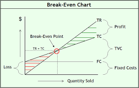
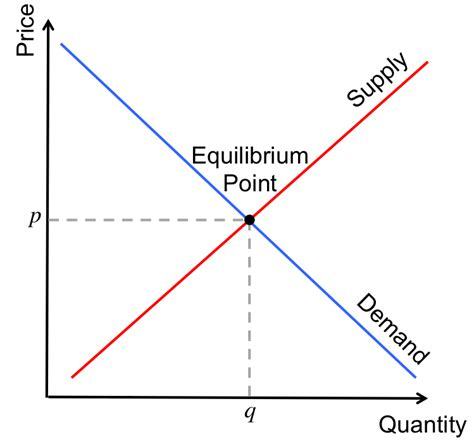

```{r setup, include=FALSE}
knitr::opts_chunk$set(echo = FALSE)
```

## **Recap of linear equations and functions**
A business property is purchased for Ksh. 122,880 and depreciated over a period of 10 years. Its value y is related to the number of months of service x by the equation;

- $4096x + 4y = 491520$

- Find the x-intercept and the y-intercept and use them to sketch the graph of the equation.

## **Recap of linear equations and functions**
Pricing
The Kenya National Bureau of Statistics indicate that the average price p of digital television sets can be
expressed as a linear function of the number of sets sold N (in thousands). In addition, as N increased by 1000, p dropped by Ksh. 10.40, and when 6485 (thousand) sets were sold, the average price per set was Ksh. 504.39. Write the equation of the line determined by this information.

Solution
We see that price p is a function of the number of sets N (in thousands), so the function is given
by;

- $p = f(N)$

## **Recap of linear equations and functions**
- Here p is analogous to y, while c is analogous to x.

- $Gradient = \frac{rise}{run} = \frac{change in Y}{Change in X} = \frac{Change in p}{Change in N}$

- $m = \frac{-10.40}{+1000}$

- We are also given one point {6485, 504.39}

- Now assume we have a point $(N_1, p_1)$ and compute the equation of the line. 

## **Recap of linear equations and functions**
- Earnings and gender: According to the KNBS, the relation between the average annual earnings of males and females with various levels of educational attainment can be modeled by the function;

- $F = 0.78M - 1.316$

- where M and F represent the average annual earnings (in thousands of Ksh) of males and females, respectively.

a) Viewing F as a function of M, what is the slope of the graph of this function?
(b) Interpret the slope as a rate of change.
(c) When the average annual earnings for males reach Ksh. 60,000, what does the equation predict for the average annual earnings for females?

## **Recap of linear equations and functions**
Consumer price index The consumer price index for urban consumers (the CPI-U) for the years 1985 to 2005 can be accurately approximated by the linear model determined by the line connecting (1985, 113.2) and (2005, 324.9), where the x-coordinate is the year and the y-coordinate is the price consumers pay in year x for goods that cost Ksh 100 in 1982;

(a) Write the equation of the line connecting these two points to find a linear model for these data.
(b) Interpret the slope of this line as a rate of change.

## **Recap of linear equations and functions**
Depreciation Suppose the cost of a business property is Ksh. 960,000 and a company wants to use a straight-line depreciation schedule for a period of 240 months. If y is the value of this property after x months, then the company’s depreciation schedule will be the equation of a line through (0, 960,000) and (240, 0). Write the equation of this depreciation schedule.

## Recap: Solving simulataneous equations and the Crammers Rule
- Solve the following set of equations using graphing, elimination, substitution, and then the crammers rule;

- $x + 2y = 5$

- $2x + 3y = 8$

## **Recap of linear equations and functions**
Pricing: A concert promoter needs to make ksh 42,000 from the sale of 1800 tickets. The promoter charges Ksh20
for some tickets and Ksh30 for the others.
(a) If there are x of the Ksh20 tickets sold and y of the Ksh30 tickets sold, write an equation that states that the
sum of the tickets sold is 1800.
(b) How much money is received from the sale of x tickets for 20 shillings each?
(c) How much money is received from the sale of y tickets for 30 shillings each?
(d) Write an equation that states that the total amount received from the sale is 42,000 shillings.
(e) Solve the equations simultaneously to find how many tickets of each type must be sold to yield the
Ksh 42,000.

## Solving Linear Equations & Linear equalities
**Linear Equations**
- Jill Ball has Ksh 900,000 to invest. She has chosen one relatively safe investment fund that has an annual yield of 10% and another, riskier one that has a 15% annual yield. How much should she invest in each fund if she would like to earn Ksh. 100,000 in one year from her investments?

- Suppose that the relationship between a firm’s profit P and the number x of items sold can be described by the equation.

$5x - 4p = 12000$

(a) How many units must be produced and sold for the firm to make a profit of Ksh. 1500?
(b) Solve this equation for P in terms of x.
(c) Find the profit when 2400 units are sold.
(d) How many items must the firm make to break even (where P = 0)?

## Linear inequalities
- An inequality is a statement that one quantity is greater than (or less than) another quantity.

- The inequality $3x - 2 > 2x + 1$ is a first-degree (linear) inequality that states that the left member is greater than the right member.

- Certain values of the variable will satisfy the inequality. These values form the solution set of the inequality.

- Which values satisfy this inequality? 

## Properties of inequalities
**Substitution Property**
- The inequality formed by substituting one expression for an equal expression is equivalent to the original inequality.

- $5x - 4x < 6$

- $x < 6$

## **Recap of linear equations and functions**
**Addition Property**
- The inequality formed by adding the same quantity to both sides of an inequality is equivalent to original inequality. 

- $2x - 4 > x + 6$

- $2x - 4 + 4 > x + 6 + 4$

- $2x > x + 10$

- $2x - x > 10$

- $x > 10$

## **Recap of linear equations and functions**
**Multiplication property 1**
- The inequality formed by multiplying both sides of an inequality by the same positive quantity is equivalent to the original inequality.

- $\frac{1}{2}x > 8$

- $\frac{1}{2}x * 2 > 8 * 2$

- $x > 16$

## **Recap of linear equations and functions**
**Multiplication property 2**
- The inequality formed by multiplying both sides of an inequality by the same negative number and reversing the direction of the inequality symbol is equivalent to the original inequality.

- $-x > 6$

- $-x * -1 < 6 * -1$

- $x < -6$


## Exercises
- Solve the inequality $2(x-4) < \frac{x -3}{3}$

- Normal Height for a Given Age

- For boys between 4 and 16 years of age, height and age are linearly related. That relation can be expressed as

- $H = 2.31A + 31.26$

- where H is height in inches and A is age in years. To account for natural variation among individuals, normal is considered to be any measure falling within 65% of the height obtained from the equation. Write as an inequality the range of normal height for a boy who is 9 years old.

## Applications of linear functions in business and economics
- **Total Cost, Total Revenue, and Profit**
- The profit(P) a firm makes on its product is the difference between the amount it receives from sales (its revenue, R) and its cost, C. If x units are produced and sold, we can write;

$P(x) = R(x) - C(x)$, where

- P(x) is the profit from selling P units.

- R(x) is the revenue from selling x units.

- C(x) is the cost of producing and selling P units. 

## Applications of linear functions in business and economics: Profit, revenue and costs
- Revenue can be generally computed as follows;

- $Revenue = price per units * Number of units sold$

- Cost has a fixed component and a variable component, such that;

- Cost = Fixed cost + Variable costs.

- Fixed costs are constant regardless of the units produced. Even if you produce and sell zero units, you still incur fixed costs. 

- Variable costs are directly proportional to the units produced / sold. If you dont produce/sell any units then variable costs will be zero. 

## Applications of linear functions in business and economics: Profit, revenue and costs
- **Example**
- Suppose a firm manufactures MP3 players and sells them for Ksh. 50 each. The costs incurred in the production and sale of the MP3 players are Ksh. 200,000 plus Ksh. 10 for each player produced and sold. Write the profit function for the production and sale of x players.

## Applications of linear functions in business and economics: Marginal costs
- This is the cost of one additional unit.

- usually given by the slope of a function as we illustrate. 

- Suppose that the cost (in shillings) for a product is $C = 21.75x + 4890$. What is the marginal cost for this product, and what does it mean?


## Applications of linear functions in business and economics: Break-even analysis
**Break-Even Anlaysis**
A manufacturer sells a product for Ksh 10 per unit. The manufacturers variable costs are Ksh 2.50
per unit and the cost of 100 units is Ksh 1450. How many units must the manufacturer produce
each month to break even?

## Break Even Analysis



## Applications of linear functions in business and economics: Supply, Demand, and Market Equilibrium

- Economists and managers also use points of intersection to determine market equilibrium. Market equilibrium occurs when the quantity of a commodity demanded is equal to the quantity supplied. 

- Demand by consumers for a commodity is related to the price of the commodity. The law of demand states that the quantity demanded will increase as price decreases and that the quantity demanded will decrease as price increases. 

- The law of supply states that the quantity supplied for sale will increase as the price of a product increases. 

- Note that although quantity demanded and quantity supplied are both functions of price p, economists traditionally graph these with price on the vertical axis.

## Market equilibrium



## Example: Market Equilibrium 

- Find the market equilibrium point for the following supply and demand functions.

-Demand $P = -3q + 36$

- Supply $p = 4q + 1$


