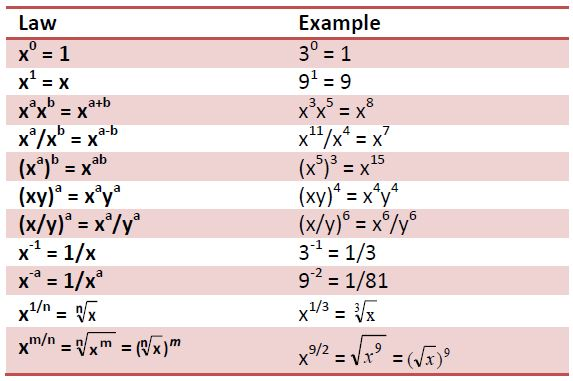
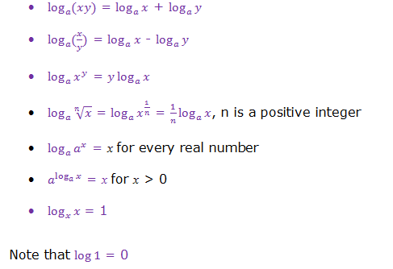

```{r setup, include=FALSE}
knitr::opts_chunk$set(echo = TRUE, echo = FALSE, warning = FALSE, message = FALSE)
```

## **Exponential Functions**

- Exponential functions take the form $y = A^{x}$

- Examples of exponential functions are;

  $y = 4^{x}$
  
  $y = 0.5^{2x}$

  $y = 2^{4x}$

  $y = e^{x}$, where $e$ is the natural number. We shall revisit this $e$ later. 
  
## **Exponential Functions: For Positive values of X (GROWTH)**

- let us see how the function behaves depending on whether x is positive or negative. 

- Let us use the functions, $y = 3^{x}$. Note the signs. 

```{r}
library(tidyverse)
tribble(~ X, ~ Y,
        "0", "1", 
        "1", "3", 
        "2", "9",
        "3", "27",
        "4", "81", 
        "5", "405") %>% 
  
  knitr::kable(booktabs = TRUE) %>% 
  
  kableExtra::kable_styling(full_width = TRUE, bootstrap_options = "striped")
```

## **Exponential Functions: For Positive values of X (GROWTH)**

```{r}
library(tidyverse)
my_exp_fn <- function(x){3^x}

ggplot(data = data.frame(x = 0), mapping = aes(x = x)) + 
  
  stat_function(fun = my_exp_fn) + xlim(-6,6) + 
  
  ggthemes::theme_clean() + 
  
  ggtitle("Graph Exponential Function for X >= 0")
```

## **Exponential Functions: For Negative values of X (DECAY)**

```{r}
library(tidyverse)
tribble(~ X, ~ Y,
        "0", "1", 
        "1", "1/3", 
        "2", "1/9",
        "3", "1/27",
        "4", "1/81", 
        "5", "1/405") %>% 
  
  knitr::kable(booktabs = TRUE) %>% 
  
  kableExtra::kable_styling(full_width = TRUE, bootstrap_options = "striped")
```

## **Exponential Functions: For Negative Values of X (DECAY)**

- let us see how the function behaves depending on whether x is positive or negative. 

- Let us use the functions, $y = 3^{-x}$. Note the signs. 


```{r}
library(tidyverse)
my_exp_fn1 <- function(x){3^-x}

ggplot(data = data.frame(x = 0), mapping = aes(x = x)) + 
  
  stat_function(fun = my_exp_fn1) + xlim(-6,6) + 
  
  ggthemes::theme_clean() + 
  
  ggtitle("Graph Exponential Function for X <= 0")
```

## **Exponential Functions**

- Exponential functions are useful in modelling growth and decay. 

- Examples are compounding investments and growth of bacteria colonies. 

## Exponent Laws

See the table below for the exponent laws that could be useful in solving some exponential functions problems. 



## Example: Exponential laws

- Simplify the following equation into the form $AB^{t}$. 

$10 * 9^{\frac{t}{2} + 2} * 5^{3t}$

- We simplify each in turn. Off course we leave the 10 alone first.

## Example: Exponential laws

We first simplify: 

$9^{\frac{t}{2} + 2}$

$9^{\frac{t}{2} + 2}$ = $9^{\frac{t}{2}} * 9^2$

$9^{\frac{t}{2} + 2}$ = $(9 ^ \frac{1}{2})^t * 9^2$

$9^{\frac{t}{2} + 2}$ = $3 ^ t * 81$

## Example: Exponential laws

We then simplify $5^{3t}$

$5^{3t}$ = $(5^3)^t$ = $125^t$

Now we have, $10 * 3 ^ t * 81 * 125^t$

We get $810 * 3 ^ t * 125^t$ = $810 * 375^t$. 

Try and understan these laws. 


## Using exponent laws to solve equations

Suppose you have the following equation; 

$5 ^ {2x + 1} = 10$

$5^{2x} * 5 ^ {1} = 10$

$(5 ^ {2})^{x} * 5 ^ {1} = 10$

$(5 ^ {2})^{x} = 2$

$25 ^ x = 2$

From here you can apply logarithms to get the final solution. Do it!


## Using exponent laws to solve equations: Exercise

1. Solve for x in, $26 ^ {9x + 5} = 1$. 

2. Joyce owns a fast food restaurant in Karatina that started operating in April, 2020. She estimates that the number of customers at the start of April 2020 (time 0) was 1000. The customer numbers are growing at a rate of 10% per month. Estimate the number of customers in December 2020, April, 2021. Is this a growth or decay function? Sketch a graph of this function. 

## Using exponent laws to solve equations: Exercise

$April20 = 1000 * 1.1^0$

$May20 = 1000 * 1.1^1 =  = 1100$

$June20 = 1000 * 1.1^2 = 1210$

So in general, $Customers = 1000 * 1.1^n$, where n is the number of months. 

## The constant $e$. 

- You will commonly come across the constant $e$, also called the natural number. 

- We define $e$ as follows;

$e = \lim_{x \to +\infty} (1 + \frac{1}{x})^x$


## The constant $e$, the Euler Number. 

If $e = \lim_{x \to +\infty} (1 + \frac{1}{x})^x$, then 

if x = 1, then $e = (1 + \frac{1}{1})^{1} = 2$

if x = 2, then $e = (1 + \frac{1}{2})^{2} = 2.25$

if x = 3, then $e = (1 + \frac{1}{3})^{3} = 2.37037$

if x = 10, then $e = (1 + \frac{1}{10})^{10} = 2.593742$

if x = 100, then $e = (1 + \frac{1}{100})^{100} = 2.704814$

if x = 10000, then $e = (1 + \frac{1}{10000})^{10000} = 2.718146$

if x = 1000000, then, $e = (1 + \frac{1}{1000000})^{1000000} = 2.71828$

if x = 1000000000, then, $e = (1 + \frac{1}{1000000000})^{1000000000} = 2.718282$

## The constant $e$, the Euler Number.

- Notice that as x gets larger and larger, the value of e converges to around 2.718281828459045...........

- There are many ways of calculating the value of e, but none of them ever give a totally exact answer, because e is irrational and its digits go on forever without repeating.

- But $e$ it is known to over 1 trillion digits of accuracy!

- Hence, we denote this number simply as $e$

- Next time you see e, be sure it is 2.718281828459045...........

- so $e^{x} = 2.718281828459045...^{x}$. From now on, we shall use only $e$. 

## The constant $e$, the Euler Number.

```{r}
my_x <- 1:500
exp_fn <- function(x){
  (1  + 1/x) ^ x
}

my_y <- sapply(my_x, exp_fn)

my_exp_data <- data.frame(my_x, my_y)

my_exp_data %>% 
  
  ggplot(aes(x = my_x, y = my_y)) + geom_point() + 
  
  labs(x = "X", y = "Y", title = "The Euler Number Limit") + 
  
  ggthemes::theme_clean()
```


## Logarithmic functions

- Logarithmic functions take the form $y = log(x)$

- The logarithm in this case could be to any base but the most common bases are $10$ and $e$, remember that $e$. 

- Log to the base of e is called the natural log (written as ln). 

```{r}
library(tidyverse)
my_log_fn <- function(x){log10(x)}

ggplot(data = data.frame(x = 0), mapping = aes(x = x)) + 
  
  stat_function(fun = my_log_fn) + xlim(0,6) + 
  
  ggthemes::theme_clean() + 
  
  ggtitle("Graph: Logarithmic Function (log to base 10)")
```


## Logarithmic functions: Laws of Logarithms



## Solve for x

$e^{x} = 5$

we know $ln = log_{e}$, so

$ln(e^{x}) = ln(5)$

$log_{e}e^{x} = log_{e}(5)$

$xlog_{e}e = log_{e}(5)$

$x(1) = log_{e}(5)$

$x = log_{e}(5)$

$x = ln(5)$ from your calculator. 