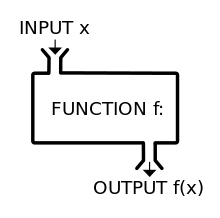

## Defining a function

- A function is a mathematical construct (think of it as an object or machine) that takes in a value `x` and outputs a value `y` in a one-to-one correspondence. 

- The letters x and y are commonly used in math, although these can be replaced with any other letters in the alphabet. 

- You will commonly see a function written as;

$y = f(x)$

$y = f(x)$ means that $y$ is a function of $x$. In other words, $x$ can be used to represent y.

## Defining a function

- Consider this; $y = 2x + 3$. The moment we know $x$, we can compute $y$.

- Are there two or more values of $x$ that yield the same value of $y$ in the equation above?

- The answer is no. This is what we mean by "one-to-one" correspondence. 

- Each $x$ that goes into the machine yields one and only one $y$

- In a situation where we have two or more values of $x$ yielding the same $y$, then our "machine" is no longer a function but a relation.

## Defining a function in a picture. 

- This is a function [Source:]




## Functions covered in this course

– Background and Definitions.

– Linear equations and functions.

– Quadratic and other special functions.

– Exponential and logarithmic functions.


## Linear equations and functions

This is an R Markdown presentation. Markdown is a simple formatting syntax for authoring HTML, PDF, and MS Word documents. For more details on using R Markdown see <http://rmarkdown.rstudio.com>.

When you click the **Knit** button a document will be generated that includes both content as well as the output of any embedded R code chunks within the document.

## Quadratic and other special functions

- Bullet 1
- Bullet 2
- Bullet 3

## Slide with R Code and Output

```{r}
summary(cars)
```

## Slide with Plot

```{r, echo=FALSE}
plot(cars)
```

