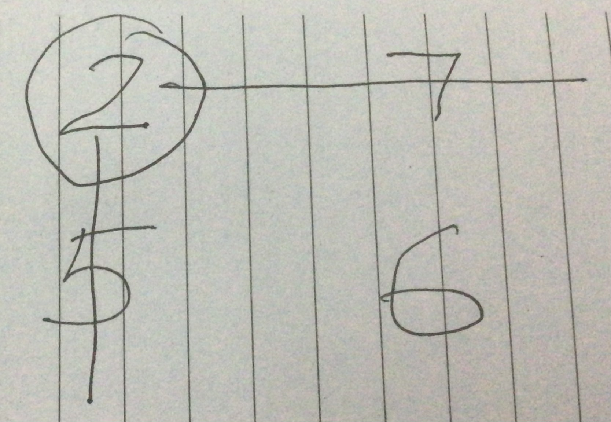
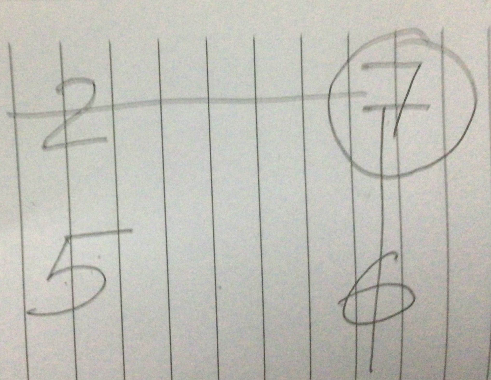
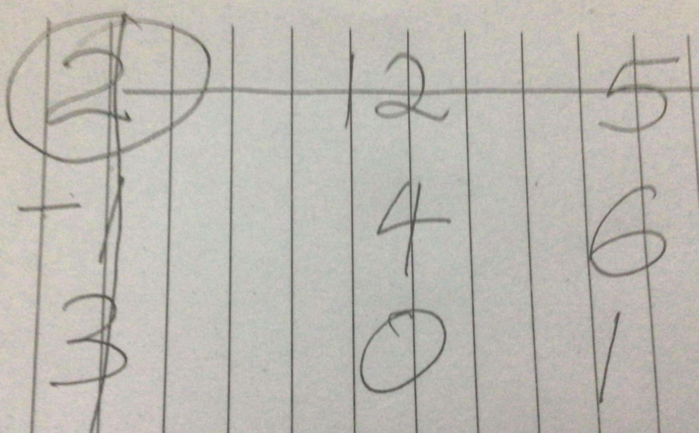
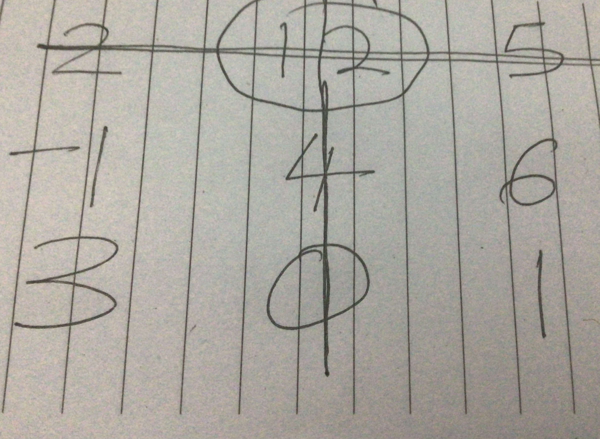
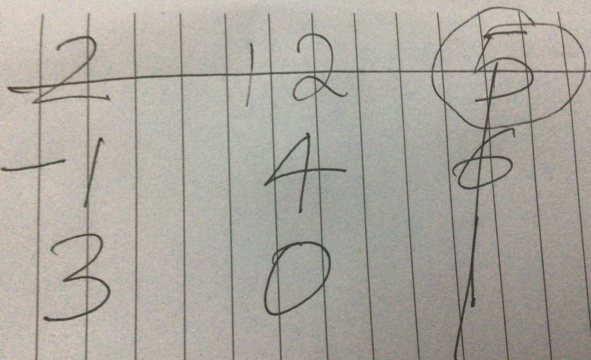

```{r setup, include=FALSE}
knitr::opts_chunk$set(echo = FALSE, message = FALSE, warning = FALSE, echo = FALSE)
```

## Introduction to matrix algebra

- A system of simultaneous linear models like $p = 4 - 2q$ and $p = 3.5 + q$ is easy to solve.

- You can use graphs, elimination, substitution, and do crammers rule all by hand. 

- However, as the variables become numerous, it is becomes increasingly difficult to solve. 

- Matrix algebra gives a short hand that allows us to manage these sets of equations. 

- This chapter examines matrices and the way to use matrix algebra to solve common problems in economics, projects, and other areas. 

## Matrix algebra: Definitions and terminology

- A matrix  (whose plural is matrices) is a rectangular array of numbers, symbols, or expressions, arranged in rows and columns.

- A matrix with m rows and n columns is called an m×n matrix or m-by-n matrix, where m and n
 are called the matrix dimensions.

- Matrices can be used to compactly write and work with multiple linear equations, that is, a system of linear equations. 

- Matrices and matrix multiplication reveal their essential features when related to linear transformations, also known as linear maps.

## Matrix algebra: Definitions and terminology

- The element of a matrix is an individual item in a matrix.

- A row vector (matrix) is a matrix with a single row.

- A column vector (matrix) is a matrix with a single column.

- A square matrix is a matrix which has the same number of rows and columns. 

- A 3 by 4 matrix (abbreviated 3 X 4) has three rows and 4 columns.

- The convention is to always start with rows (R) then columns (C)- RC. 

## Matrix algebra: An example
- Take a set of simultaneous equations as follows;

- $c_1P_1 + c_2P_2 = -c_0$, and;

- $\gamma_1P_1 + \gamma_2P_2 = -\gamma_0$, can be written in matrix form in three parts as;


\[
M=
  \begin{bmatrix}
    c_0 \\
    -\gamma_0
  \end{bmatrix}
\]

- Hence, $M * N = P$

\[
N=
  \begin{bmatrix}
    P_1 \\
    P_2
  \end{bmatrix}
\]

\[
P=
  \begin{bmatrix}
    P_1 \\
    P_2
  \end{bmatrix}
\]

## Matrix algebra: An example

- The number of rows and columns of a matrix together define its **dimension**. 
- M is a 2X2 matrix- it has 2 rows and 2 columns
- N is a 2X1 matrix. N is a special type of matrix called a column matrix as it has just one column. This is a vector, a special type of matrix. 
- A matrix with one row and 2 or more columns is a row matrix. This is also a vector, a special type of matrix. 
- A special matrix with one row and one column is a scalar, for instance number $4$. 

## Matrix algebra: An example

- Our equation above them becomes

\[
\underbrace{\begin{bmatrix}
c_1      &   c_2       \\
\gamma_1      &   \gamma_2   \\
            \end{bmatrix}
            }_{\mathbf{M}}
\underbrace{\begin{bmatrix}
P_1     \\
P_2     \\
            \end{bmatrix}
            }_{\mathbf{N}}
    =
\underbrace{\begin{bmatrix}
c_0     \\
-\gamma_0
            \end{bmatrix}
            }_{\mathbf{P}}
\]

- With $M * N = P$. 

- Write the following set of equations in matrix format; Try solving it using crammers rule. 

- $p + 4Q = 80$

- $2p - Q = 30$

## Matrix algebra: The general form of linear equations using matrices

- We can generalize that any set of linear equations can be written as follows in linear algebra. 

\[
\underbrace{\begin{bmatrix}
a       &   b       & \dots     &   n       \\
a       &   b       & \dots     &   n       \\
\vdots  &  \vdots   &   \vdots  &   \vdots  \\   
a       &   b       & \dots     &   n       \\
            \end{bmatrix}
            }_{\mathbf{a}}
            *
\underbrace{\begin{bmatrix}
w_1     \\
w_2     \\
\vdots  \\
w_n     \\
            \end{bmatrix}
            }_{\mathbf{b}}
    =
\underbrace{\begin{bmatrix}
y_1     \\
y_2     \\
\vdots  \\
y_n     \\
            \end{bmatrix}
            }_{\mathbf{c}}
\]

- With $a * b = c$

- $a$ represents the coefficients. $b$ stands for the variables.

## Matrix algebra: An example
- Rewrite the following set of equations in matrix form as denoted in the previous page. 

- $6x_1 + 3x_2 + x_3 = 22$

- $x_1 + 4x_2 - 2x_3 = 12$

- $4x_1 - x_2 + 5x_3 = 10$

- So far, we have NOT learnt enough to be able to solve this set of equations using crammers rule. 

## Matrix operations
- In this section, we cover matrix addition, subtraction, and multiplication. The matrices MUST have the same dimension though. 

- Note that two matrices are equal if and only if (iff) they have the same dimensions and have identical elements in the corresponding locations in the array. 

## Matrix Operations: Adding/ subtracting two matrices

- The addition and subtraction of matrices is element-wise.

- For addition, it is as follows;

\[
\underbrace{\begin{bmatrix}
c_1      &   c_2       \\
\gamma_1      &   \gamma_2   \\
            \end{bmatrix}
            }_{\mathbf{A}}
            +
\underbrace{\begin{bmatrix}
d_1  & d_2   \\
\theta_1 & \theta_2     \\
            \end{bmatrix}
            }_{\mathbf{B}}
    =
\underbrace{\begin{bmatrix}
c_1+d_1 & c_2+d_2     \\
\gamma_1 + \theta_1 & \gamma_2 + \theta_2
            \end{bmatrix}
            }_{\mathbf{P}}
\]

- For subtraction, its similar;
\[
\underbrace{\begin{bmatrix}
a_1      &   a_2       \\
\epsilon_1      &   \epsilon_2   \\
            \end{bmatrix}
            }_{\mathbf{R}}
            -
\underbrace{\begin{bmatrix}
v_1  & v_2   \\
\alpha_1 & \alpha_2     \\
            \end{bmatrix}
            }_{\mathbf{S}}
    =
\underbrace{\begin{bmatrix}
a_1-v_1 & a_2-v_2     \\
\epsilon_1 - \alpha_1 & \epsilon_2 - \alpha_2
            \end{bmatrix}
            }_{\mathbf{T}}
\]

## Matrix algebra: Multiplication/ division of a matrix with a scalar. 

- Like addition and subtraction, multiplication and division of a matrix with a scalar is element-wise. For multiplication. 

\[
\underbrace{\begin{bmatrix}
c_1 
            \end{bmatrix}
            }_{\mathbf{R}}
            *
\underbrace{\begin{bmatrix}
v_1  & v_2   \\
\alpha_1 & \alpha_2     \\
            \end{bmatrix}
            }_{\mathbf{S}}
    =
\underbrace{\begin{bmatrix}
c_1*v_1 & c_1*v_2     \\
c_1* \alpha_1 & c_2*\alpha_2
            \end{bmatrix}
            }_{\mathbf{T}}
\]


## Matrix algebra: Multiplication/ division of a matrix with a scalar. 
- For division, it is;

\[
\underbrace{\begin{bmatrix}
a_1      &   a_2       \\
\epsilon_1      &   \epsilon_2   \\
            \end{bmatrix}
            }_{\mathbf{K}}
            /
\underbrace{\begin{bmatrix}
d_1
            \end{bmatrix}
            }_{\mathbf{L}}
    =
\underbrace{\begin{bmatrix}
a_1/d_1 & a_2/d_1     \\
\epsilon_1 /d_1 & \epsilon_2 /d_1
            \end{bmatrix}
            }_{\mathbf{M}}
\]

- Think of division of a matrix ($A$) with a scalar ($K$) as multiplying the matrix with $1/K$. 

## Matrix operations, exercises

- Given three matrices A, B and C as follows;

\[
{\begin{bmatrix}
A       \\
            \end{bmatrix}
            }
            =
{\begin{bmatrix}
10  & 18 & 14   \\
16 & 12 & 10     \\
5 & 4 & -1
            \end{bmatrix}
            }
\]

\[
{\begin{bmatrix}
B       \\
            \end{bmatrix}
            }
            =
{\begin{bmatrix}
-12  & 4 & 3  \\
1 & -12 & 25     \\
15 & 12 & 10
            \end{bmatrix}
            }
\]

\[
{\begin{bmatrix}
C       \\
            \end{bmatrix}
            }
            =
{\begin{bmatrix}
100  & 37 & 4  \\
            \end{bmatrix}
            }
\]

## Matrix operations, exercises

- Which 2 pairs of matrices are compatible for addition, subtraction. 

- Compute 3A, -4B, and 6C. 

- Compute A + B.

- Compute 3 * A. 

- Compute B/10.

## Matrix operations: Multiplication/ division of two matrices. 

- We start with multiplication using a simplified illustration. 

- Given two matrices A, B as follows;

\[
{\begin{bmatrix}
A       \\
            \end{bmatrix}
            }
            =
{\begin{bmatrix}
\alpha_1  & \theta_1  \\
\theta_1 & \gamma_1     \\
            \end{bmatrix}
            }
\]

\[
{\begin{bmatrix}
B       \\
            \end{bmatrix}
            }
            =
{\begin{bmatrix}
\rho_1 & \tau_1  \\
\psi_1 & \omega_1     \\
            \end{bmatrix}
            }
\]

- Then A X B will be;

## Matrix operations: Multiplication/ division of two matrices. 

\[
\underbrace{\begin{bmatrix}
\alpha_1  & \theta_1  \\
\lambda_1 & \gamma_1     \\
            \end{bmatrix}
            }_{\mathbf{A}}
            *
\underbrace{\begin{bmatrix}
\rho_1 & \tau_1  \\
\psi_1 & \omega_1     \\
            \end{bmatrix}
            }_{\mathbf{B}}
    =
\underbrace{\begin{bmatrix}
\alpha_1*\rho_1 + \theta_1 * \psi_1 & \alpha_1*\tau_1 + \theta_1 * \omega_1 \\
\lambda_1*\rho_1 + \gamma_1 * \psi_1 & \lambda_1*\tau_1 + \gamma_1 * \omega_1 \\
            \end{bmatrix}
            }_{\mathbf{C}}
\]

- Example
\[
\underbrace{\begin{bmatrix}
2  & 5  \\
7 & 1     \\
            \end{bmatrix}
            }_{\mathbf{A}}
            *
\underbrace{\begin{bmatrix}
3 & 0  \\
8 & 11     \\
            \end{bmatrix}
            }_{\mathbf{B}}
    =
\underbrace{\begin{bmatrix}
2*3 + 5*8 & 2*0+5*11 \\
7*3 + 1*8 & 7*0 + 1*11\\
            \end{bmatrix}
            }_{\mathbf{C}}
\]

## Matrix operations: Multiplication/ division of two matrices.

- Multiply the following matrices A and B. 
\[
{\begin{bmatrix}
A       \\
            \end{bmatrix}
            }
            =
{\begin{bmatrix}
10  & 59  \\
-16 & 25
            \end{bmatrix}
            }
\]

\[
{\begin{bmatrix}
B       \\
            \end{bmatrix}
            }
            =
{\begin{bmatrix}
1  & 95  \\
-61 & 52
            \end{bmatrix}
            }
\]

## Matrix operations: Multiplication/ division of two matrices.
- Multiply the following two matrices S and T. 

\[
{\begin{bmatrix}
S       \\
            \end{bmatrix}
            }
            =
{\begin{bmatrix}
10  & 59 & 70  \\
-16 & 25 & 12 \\
39 & 0 & -1
            \end{bmatrix}
            }
\]

\[
{\begin{bmatrix}
T       \\
            \end{bmatrix}
            }
            =
{\begin{bmatrix}
1  & 95 & 7  \\
-61 & 52 & 21 \\
93 & 0 & -10
            \end{bmatrix}
            }
\]

## Division of matrices

- While matrices can undergo addition, subtraction and multiplication, division is a bit tricky.

- Take two numbers 2 and 3. We can divide the two as $2/3$ which is also $2 * 1/3$.

- $2 * 1/3 = 2 * 3^{-1}$

- Similarly given two matrices A and B, we could then say $A/B = A * B^{-1}$. 

- However, for matrices, this is not always the case. 

## Division of matrices

- For instance $B^{-1}$ (called the inverse of B) may not exist. 

- In other cases, even where $B^{-1}$ is defined, $A * B^{-1}$ may not be defined. 

- Still, even where $B^{-1}$ is defined, $A * B^{-1}$ may not equal $B^{-1}*A$. 

- We shall discuss this under matrix determinants and inverses. 

## Notes on the multiplication of vectors

- Remember vectors are special types of matrices.

- vectors are either row matrices or column matrices. 

- When multiplying matrices, you first check for compatibility by ensuring the number of columns in the first matrix equals the number of rows in the second matrix. 

- Only one exception;

## Notes on the multiplication of vectors

\[
{\begin{bmatrix}
A       \\
            \end{bmatrix}
            }
            =
{\begin{bmatrix}
10 \\
-16
            \end{bmatrix}
            }
\]

\[
{\begin{bmatrix}
B       \\
            \end{bmatrix}
            }
            =
{\begin{bmatrix}
1  & 95 & 5  \\
            \end{bmatrix}
            }
\]


- Multiply the 10 in A with all elements in B.

- Multiply the -16 in A with all elements of B. 

_ we get 

\[
{\begin{bmatrix}
B       \\
            \end{bmatrix}
            }
            =
{\begin{bmatrix}
10  & 950 & 50  \\
-16 & -1520 & -80
            \end{bmatrix}
            }
\]

## The summation sign and its applications

- The Greek alphabet $\Sigma$ is used to denote summations. 

- For instance we may want to add $x_1 + x_2 + x_3 + x_4 + x_5 + x_6$. These are 6 numbers. 

- We can let k demote the subscripts $1, 2, 3, ...., 6$. 

- We can write this concisely as $\sum_{k=1}^{6} x_{k}$.

- We read this as summation for k = 1 to 6 of $x_{k}$, and is equal to $x_1 + x_2 + x_3 + x_4 + x_5 + x_6$

- Note that the $k$ could be replaced by any other letter or symbol. $k$ we have just chosen $k$ for the example. 

## The summation sign and its applications: Example

- Write $ax_1 + ax_2 + ax_3 + ax_4$ concisely using the summation notation. 

- We can rewrite this as $a(x_1 + x_2 + x_3 + x_4)$.

- Lets choose letter $j$ this time to capture the subscripts. Note we have 4 summations, so $j = 1, ....., 4$

- This becomes $a\sum_{j=1}^{4} x_{j}$

## The summation sign and its applications: Example

- Write the following in concise summation notation. 

- $ax_1^{1} + ax_2^{2} + ax_3^{3} + ax_4^{4} + ax_5^{5} + ax_6^{6}$.

- we can rewrite this as $a(x_1^{1} + x_2^{2} + x_3^{3} + x_4^{4} + x_5^{5} + x_6^{6})$.

- Note that both the subscript and power move together in this case $x_1^{1}$, for example. 

- Lets use the symbol w in this case which goes from 1 to 6 $x_1^{1} to x_6^{6}$

- So we can say, $a\sum_{w=1}^{6} x_{w}^{w}$

- This will be a common occurrence in your economics and project management classes now and in the future. Please read more on this. 


## The concept of linear dependence

- A set of vectors $c_1, c_2, ....... ,c_n$ are said to be linearly dependent if we can write any one of them as a linear combination of the other vectors. 

- Example. 

## The vector space 

- Research on the idea of a vector space.

- How do we compute Euclidean distance?

- Give an example showing the computation of the Euclidean distance. 

- Does the Pythagoras theorem represent Euclidean distance?

## Square Matrices, Identity Matrices and Null Matrices

- The square matrix has the number of rows equal to the number of columns. 

- Examples are matrices with dimensions, 2X2, 3X3, and so on. 

- Null matrices of the other hand have all their elements equal to zero. 

- The identity matrix (abbreviated as I) is a SQUARE matrix whose main diagonal elements are one (1), while all the other elements are zero. 

- The main diagonal is the central diagonal in a matrix that slopes from left to right. 

## Examples of Identity Matrices

\[
{\begin{bmatrix}
S       \\
            \end{bmatrix}
            }
            =
{\begin{bmatrix}
1  & 0 & 0  \\
0 & 1 & 0 \\
0 & 0 & 1
            \end{bmatrix}
            }
\]

\[
{\begin{bmatrix}
T       \\
            \end{bmatrix}
            }
            =
{\begin{bmatrix}
1  & 0 & 0 & 0 \\
0 & 1 & 0 & 0 \\
0 & 0 & 1 & 0 \\
0 & 0 & 0 & 1
            \end{bmatrix}
            }
\]


## Identity Matrices: Properties

- When you multiply a matrix B with the identity matrix I, the result is B.

- Think about when you multiply any number, say 549, by one. You get the same number 549. 

- Similarly, the identity matrix behaves like the one in number multiplication. 

- The NULL matrix is the zero. Multiply any matrix with the NULL matrix and you get the NULL matrix. 

- $A * I = A$

- $A * NULL = NULL$

## Identity Matrices: Properties
- Note that when you multiply any number, say 3, with its inverse, $\frac{1}{3}$, you always get one. 

- Likewise, when you multiply a matrix with its inverse you get an identity matrix of the same dimension. 

- $A * A^{-1} = I$, where $I$ is the identity matrix. 

## Contradicitions in matrix algebra

- In matrix algebra, generally $A * B \neq B * A$. Order matters in multiplication. 

- In ordinary maths, you cannot multiply two numbers both NOT EQUAL TO ZERO and get a zero. 

- Remember a zero in numbers is equivalent to the NULL matrix in matrices. 

- Consider this example;

\[
\underbrace{\begin{bmatrix}
2  & 4  \\
1 & 2     \\
            \end{bmatrix}
            }_{\mathbf{A}}
            *
\underbrace{\begin{bmatrix}
-2 & 4  \\
1 & -2     \\
            \end{bmatrix}
            }_{\mathbf{B}}
    =
\underbrace{\begin{bmatrix}
0 & 0 \\
0 & 0\\
            \end{bmatrix}
            }_{\mathbf{C}}
\]


- Lesson: In Matrices, do not borrow from number operations blindly. 

## Transposes, Determinants, & Inverses

- When the rows and columns of a matrix are interchanged, such that the first row becomes the first column, and so on, we get the transpose of the matrix. 

- Given a matrix A, the transpose is denoted $A^T$ or $A^{'}$.

- Example; Find the transpose $B^T$ of;

\[
{\begin{bmatrix}
B       \\
            \end{bmatrix}
            }
            =
{\begin{bmatrix}
10  & 950 & 50  \\
-16 & -1520 & -80
            \end{bmatrix}
            }
\]

## Properties of Transposes

- $(A^T)^{T} = A$. 

- The transpose of a transpose gives you the original matrix. 

- $(A + B)^{T} = A^{T} + B^{T}$.

- $(AB)^{T} = B^{T}*A^{T}$. 

- In this case note the order of A and B. 

## Properties of Transposes

- Example: Given the two matrices $A$ and $B$ below, show that these three properties hold. 

\[
{\begin{bmatrix}
A       \\
            \end{bmatrix}
            }
            =
{\begin{bmatrix}
0  & 3  \\
5 & 4
            \end{bmatrix}
            }
\]

\[
{\begin{bmatrix}
B       \\
            \end{bmatrix}
            }
            =
{\begin{bmatrix}
5  & 8  \\
1 & 4
            \end{bmatrix}
            }
\]


## The Determinant: simple case of a $2X2$ matrix.

- Given a $2X2$ matrix, the determinant is the difference between the products of the main diagonal and the secondary diagonal. 

- Example: For the two matrices below compute the determinant. 

## The Determinant: simple case of a $2X2$ matrix.

\[
{\begin{bmatrix}
A       \\
            \end{bmatrix}
            }
            =
{\begin{bmatrix}
0  & 3  \\
5 & 4
            \end{bmatrix}
            }
\]

\[
{\begin{bmatrix}
B       \\
            \end{bmatrix}
            }
            =
{\begin{bmatrix}
5  & 8  \\
1 & 4
            \end{bmatrix}
            }
\]


- $|A| = (0 * 4) - (5 * 3) = -15$

- $|B| = (5 * 4) - (1 * 8) = 12$


## The Determinant: Exercises
- Compute the determinant of the following matrices separately. 

\[
{\begin{bmatrix}
A       \\
            \end{bmatrix}
            }
            =
{\begin{bmatrix}
1  & 7  \\
6 & 4
            \end{bmatrix}
            }
\]

\[
{\begin{bmatrix}
B       \\
            \end{bmatrix}
            }
            =
{\begin{bmatrix}
2  & 7  \\
5 & 6
            \end{bmatrix}
            }
\]


## The inverse of a matrix: Simple case of a two by two matrix

- Some square matrices, say A, have an inverse, written as $A^{-1}$ such that $A * A^{-1} = I$, where I is the identity matrix. 

- For a $2X2$ matrix A, we get the inverse as follows;

  - Calculate the determinant (D) of the matrix. 
  
  - Interchange the positions of the elements in the main diagonal, and then 
  
  - Change the signs of the elements in the secondary diagonal so that $+$ becomes $-$ and vice versa. 
  
  - You get a new matrix, call this $X$. The inverse of A, denoted $A^{-1}$ is;
  
  - $A^{-1} = \frac{1}{D} * X$
  
- Calculate the inverses of the above two matrices in the previous page. 

## A new way to think about determinants

- Lets take an example of the matrix below.

\[
{\begin{bmatrix}
B       \\
            \end{bmatrix}
            }
            =
{\begin{bmatrix}
2  & 7  \\
5 & 6
            \end{bmatrix}
            }
\]

##  A new way to think about determinants ... cont'd.

- Starting with the top left corner, circle the element 2.

- Draw a vertical line starting from 2. 

- Draw a horizontal line starting from 2. As follows;

##  A new way to think about determinants ... cont'd.



##  A new way to think about determinants ... cont'd.

- We now take the number we have circled (2) and the number that none of the lines do not go through (6). i.e. 2 times 6 = 12. 

- Now we go to the number on the top right (7) and repeat the same procedure, as follows.

- Circle the 7 and draw a vertical and horizontal line accross the matrix. see below. 

##  A new way to think about determinants ... cont'd.



##  A new way to think about determinants ... cont'd.

- Again, we take the circled number, 7 and the one that no line crosses, 5. 

- We have 7 * 5 = 35. 

- Note now we have two products (2 * 6 = 12) from the first and (7 * 5 = 35) for the second.

- Now we assign a positive sign to the first product and a negative sign to the second. 

- We have (+12) and (-35).

- Add the two to get your determinant. $12 - 35 = -23$

- is this the same figure you got using the straightforward method?
  
## Higher order inverses and determinants.

- We shall next examine determinants and inverses of SQUARE matrices with dimensions higher than $2X2$. 

- Let us start with the determinants. 

- We shall use the technique just covered ... the new way to think about determinants. 

- We shall just deal with 3 X 3 matrix although the technique extends to any size of matrix. 

## Higher order inverses and determinants.

- Consider a matrix; 


\[
{\begin{bmatrix}
S       \\
            \end{bmatrix}
            }
            =
{\begin{bmatrix}
2  & 12 & 5  \\
-1 & 4 & 6 \\
3 & 0 & 1
            \end{bmatrix}
            }
\]


- We shall start with the top left and deal with the first row, number by number just like we did before. 

- Lets begin by crossing out the top left number, then draw a vertical and horizontal straight line from this number to the rest of the matrix, as follows. 


## Higher order inverses and determinants.



## Higher order inverses and determinants.
- like we did, take the circled number (2), and note this time we are left with a 2 X 2 matrix not touched by the vertical, horizontal lines. 

- We have;

  - $2$, and 
  
  
\[
{\begin{bmatrix}
S       \\
            \end{bmatrix}
            }
            =
{\begin{bmatrix}
4 & 6 \\
0 & 1
            \end{bmatrix}
            }
\]
  
  - Lets get the determinant of this 2 X 2 matrix = 4 - 0 = 4. 
  - Now we have 2 * 4. 

## Higher order inverses and determinants.

- Now lets do the same for the top row middle number. As follows. 



## Higher order inverses and determinants.

- Again, we are left with a circled number 12 and a matrix.

\[
{\begin{bmatrix}
S       \\
            \end{bmatrix}
            }
            =
{\begin{bmatrix}
-1 & 6 \\
3 & 1
            \end{bmatrix}
            }
\]

- The determinant of the matrix is -19. 

- We now have another pair 12 * -19.

## Higher order inverses and determinants.

- Lets repeat the same for the last figure in the first row of our 3X3 matrix. (5). 



## Higher order inverses and determinants.

- Again, we have a number 5 and a matrix whose determinant is -12. 

- So in this case we have a product (5 * -12). 

- We have three pairs of products ($2 * 4$), ($12 * -19$), ($5 * -12$).

- We have $8$, $-228$, and $-60$. 

- We assign alternating $+$ and negative signs, starting with $+$

- The first product takes $+$, the second $-$, and the third $+$. 

- Now we have $8$, $228$, and $-60$. Add up to get determinant of 176. 

## Exercises to ponder
- Get the determinant of the folowing matrices;

- Take your time to absorb this. 

\[
{\begin{bmatrix}
S       \\
            \end{bmatrix}
            }
            =
{\begin{bmatrix}
2  & 8 & 9  \\
-3 & 7 & 6 \\
3 & 2 & 1
            \end{bmatrix}
            }
\]


\[
{\begin{bmatrix}
K       \\
            \end{bmatrix}
            }
            =
{\begin{bmatrix}
2  & 1 & 5  \\
1 & 4 & 4 \\
3 & 2 & 1
            \end{bmatrix}
            }
\]