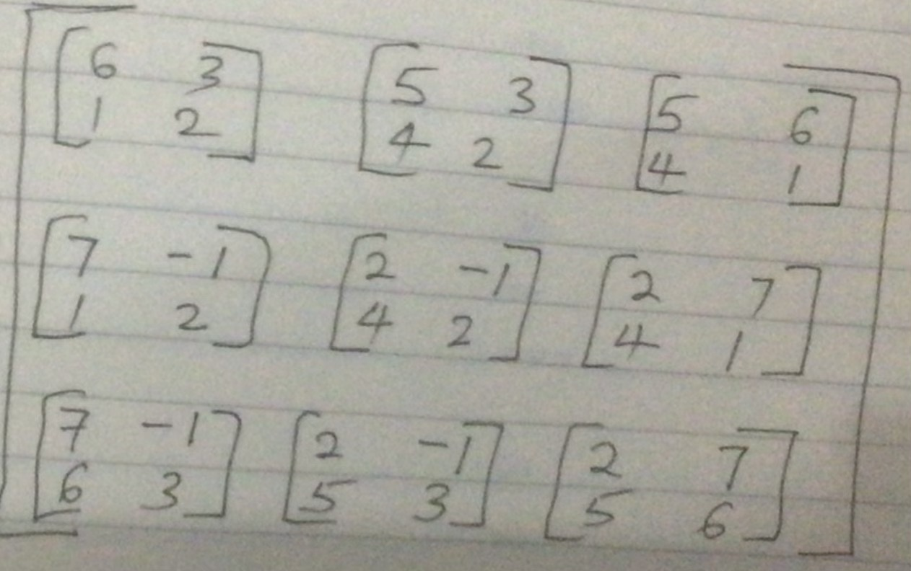

```{r setup, include=FALSE}
knitr::opts_chunk$set(echo = FALSE, message = FALSE, warning = FALSE, echo = FALSE, fig.width = 4, fig.height = 4)
```

## The inverse of a matrix

- For a 2X2 matrix the inverse is straight forward. 

- Let us remind ourselves of the steps. 

1. Compute the determinant |D| - the difference between the products of the primary and secondary diagonals.

2. Interchange the elements in the main diagonal. 

3. Change the signs of the elements in the secondary diagonal. 

4. Multiply the resultant matrix with $\frac{1}{D}$.

## An example of the inverse of a 2X2 matrix

- Consider the following matrix A.Compute its determinant and inverse. 

\[
{\begin{bmatrix}
A       \\
            \end{bmatrix}
            }
            =
{\begin{bmatrix}
2  & 7  \\
5 & 6
            \end{bmatrix}
            }
\]

- We get the determinant |D| as (2 * 6) - (7 * 5) = -23

- We then interchange the elements in the primary diagonal and change the signs of the elements in the secondary diagonal. We get matrix B below;

\[
{\begin{bmatrix}
B      \\
            \end{bmatrix}
            }
            =
{\begin{bmatrix}
6  & -7  \\
-5 & 2
            \end{bmatrix}
            }
\]


## An example of the inverse of a 2X2 matrix

- We then multiply matrix B with $\frac{1}{D}$ to get a new matrix.

\[
{\begin{bmatrix}
B      \\
            \end{bmatrix}
            }
            =
{\begin{bmatrix}
6/-23  & -7/-23  \\
-5/-23 & 2/-23
            \end{bmatrix}
            }
\]

- If you multiply A * B, you should get the identity matrix. Try it. 

```{r}
initial_inverse <- matrix(c(2, 7, 5, 6), byrow = TRUE, nrow = 2)

initial_inverse %*% solve(initial_inverse)
```


## A new way to think about inverses

- Let us do the same question a different way. Getting the inverse. 

\[
{\begin{bmatrix}
A       \\
            \end{bmatrix}
            }
            =
{\begin{bmatrix}
2  & 7  \\
5 & 6
            \end{bmatrix}
            }
\]

- We know the determinant is -23. 

- We now get the co-factor matrices in a manner we have looked at previously. 

- Start on the top right, circle the two and draw a vertical and horizontal line from the two. 

- Do this for all elements this time; unlike for the determinant where we only dealt with the first row. 


## A new way to think about inverses

1. **STEP 1**

- We will have a new matrix, see workings below

\[
{\begin{bmatrix}
A       \\
            \end{bmatrix}
            }
            =
{\begin{bmatrix}
6  & 5  \\
7 & 2
            \end{bmatrix}
            }
\]

## A new thinking about inverses (This to top left)


## A new thinking about inverses (This to top right)


## A new thinking about inverses (This to bottom left)


## A new thinking about inverses (This to bottom right)


## ## A new thinking about inverses 

2. **STEP 2**

\[
{\begin{bmatrix}
A       \\
            \end{bmatrix}
            }
            =
{\begin{bmatrix}
6  & 5  \\
7 & 2
            \end{bmatrix}
            }
\]

- Starting from top left rowwise, add alternating positive and negative signs. Start with + in first row. 

- Starting from top left rowwise, add alternating positive and negative signs. Start with - in second row. 

- If you had a third row, you would start with a positive. 

- And so on. 

## ## A new thinking about inverses

2. **STEP 2**

\[
{\begin{bmatrix}
A       \\
            \end{bmatrix}
            }
            =
{\begin{bmatrix}
6(+)  & 5(-)  \\
7(-) & 2(+)
            \end{bmatrix}
            }
\]

\[
{\begin{bmatrix}
A       \\
            \end{bmatrix}
            }
            =
{\begin{bmatrix}
6  & -5 \\
-7 & 2
            \end{bmatrix}
            }
\]

- Notice this is similar to interchanging elements in the main diagonal and changing the signs of elements in the secondary diagonal. 

## ## A new thinking about inverses 

2. **STEP 3**

- We then transpose the matrix.

- Transposing means the rows become the columns and vice versa. 

_ we get; 

\[
{\begin{bmatrix}
A       \\
            \end{bmatrix}
            }
            =
{\begin{bmatrix}
6  & -7  \\
-5 & 2
            \end{bmatrix}
            }
\]

- Finally, multiply this matrix with $\frac{1}{|D|} = \frac{-1}{23}$ as we did earlier. 

## The inverse of a 3X3 matrix

- We shall apply the same principle to get the inverse of a 3X3 matrix. 

- Consider this example. 

\[
{\begin{bmatrix}
Z       \\
            \end{bmatrix}
            }
            =
{\begin{bmatrix}
2  & 7 & -1  \\
5 & 6 & 3 \\
4 & 1 & 2
            \end{bmatrix}
            }
\]

## ## The inverse of a 3X3 matrix: Step 1: The determinant. 

- We get the following, see workings below
- start with top left, the 2.

\[
\underbrace{\begin{bmatrix}
2 
            \end{bmatrix}
            }_{\mathbf{R}}
            *
\underbrace{\begin{bmatrix}
6  & 3   \\
1 & 2     \\
            \end{bmatrix}
            }_{\mathbf{S}}
\]

- Then the 7
\[
\underbrace{\begin{bmatrix}
7
            \end{bmatrix}
            }_{\mathbf{R}}
            *
\underbrace{\begin{bmatrix}
5  & 3   \\
4 & 2     \\
            \end{bmatrix}
            }_{\mathbf{S}}
\]


## ## The inverse of a 3X3 matrix: Step 1: The determinant.

- Then the -1
\[
\underbrace{\begin{bmatrix}
-1
            \end{bmatrix}
            }_{\mathbf{R}}
            *
\underbrace{\begin{bmatrix}
5  & 6  \\
4 & 1   \\ 
            \end{bmatrix}
            }_{\mathbf{S}}
\]


## ## The inverse of a 3X3 matrix: Step 1: The determinant.

- We allocate signs so the first matrix gets +, the second - and the third +. 

- We then add up the three. Note you have to get the determinants of the 2X2 matrices. WE have;


\[
\underbrace{\begin{bmatrix}
(+)2 
            \end{bmatrix}
            }_{\mathbf{R}}
            *
\underbrace{\begin{bmatrix}
6  & 3   \\
1 & 2     \\
            \end{bmatrix}
            }_{\mathbf{S}}
\]


\[
\underbrace{\begin{bmatrix}
(-)7
            \end{bmatrix}
            }_{\mathbf{R}}
            *
\underbrace{\begin{bmatrix}
5  & 3   \\
4 & 2     \\
            \end{bmatrix}
            }_{\mathbf{S}}
\]


## ## The inverse of a 3X3 matrix: Step 1: The determinant.


\[
\underbrace{\begin{bmatrix}
(+)-1
            \end{bmatrix}
            }_{\mathbf{R}}
            *
\underbrace{\begin{bmatrix}
5  & 6  \\
4 & 1   \\ 
            \end{bmatrix}
            }_{\mathbf{S}}
\]


## The inverse of a 3X3 matrix: Step 1: The determinant.

- The determinant becomes;

$(+2 * 9 ) + (-7 * -2) + ((-1) * -19) = 51$


## ## The inverse of a 3X3 matrix: Step 2- the cofactor matrix

- We shall do an exercise similar to that of the determinant but now for all elements. 

- As usual we start with the top left, circle the figure there, draw the lines. 

\[
{\begin{bmatrix}
Z       \\
            \end{bmatrix}
            }
            =
{\begin{bmatrix}
2  & 7 & -1  \\
5 & 6 & 3 \\
4 & 1 & 2
            \end{bmatrix}
            }
\]


- We are left with a 2X2 matrix. See below. 

## ## The inverse of a 3X3 matrix: Step 2- the cofactor matrix ()


## ## The inverse of a 3X3 matrix: Step 2- the cofactor matrix ()


## ## The inverse of a 3X3 matrix: Step 2- the cofactor matrix ()


## ## The inverse of a 3X3 matrix: Step 2- the cofactor matrix ()


## ## The inverse of a 3X3 matrix: Step 2- the cofactor matrix ()


## ## The inverse of a 3X3 matrix: Step 2- the cofactor matrix ()


## ## The inverse of a 3X3 matrix: Step 2- the cofactor matrix ()


## ## The inverse of a 3X3 matrix: Step 2- the cofactor matrix ()


## ## The inverse of a 3X3 matrix: Step 2- the cofactor matrix ()


## ## The inverse of a 3X3 matrix: Step 2- the cofactor matrix together

- We write the cofactor matrices together as follows;

## ## The inverse of a 3X3 matrix: Step 3- the cofactor matrix ()



## ## The inverse of a 3X3 matrix: Step 4- the cofactor matrix  determinants()

- We then compute the determinant of each cofactor matrix and get a new matrix;

\[
{\begin{bmatrix}
Z       \\
            \end{bmatrix}
            }
            =
{\begin{bmatrix}
9  & -2 & -19  \\
15 & 8 & -26 \\
27 & 11 & -23
            \end{bmatrix}
            }
\]

## ## The inverse of a 3X3 matrix: Step 4- the cofactor matrix signs

- Like we did earlier, we allocate alternating + and - signs for the cofactor matrix above.

- In the first row, we start with a +, then -, then +, and so on. 

- In the second row, we start with a -, then +, then -, and so on. 

- In the third row, we begin with a +, then -, then +, and so on. 

- By `and son on` i mean if the matrix was beyond 3X3, you would go on alternating the signs till the end. 

## ## The inverse of a 3X3 matrix: Step 4- the cofactor matrix signs


## ## The inverse of a 3X3 matrix: Step 4- the cofactor matrix signs

\[
{\begin{bmatrix}
Z       \\
            \end{bmatrix}
            }
            =
{\begin{bmatrix}
9  & 2 & -19  \\
-15 & 8 & 26 \\
27 & -11 & -23
            \end{bmatrix}
            }
\]

## ## The inverse of a 3X3 matrix: Step 4- transpose the cofactor matrix


\[
{\begin{bmatrix}
Z       \\
            \end{bmatrix}
            }
            =
{\begin{bmatrix}
9  & -15 & 27  \\
2 & 8 & -11 \\
-19 & 26 & -23
            \end{bmatrix}
            }
\]


## ## The inverse of a 3X3 matrix: Step 4- multiply with (1/determinant). 

- Recall out determinant was 51.

\[
{\begin{bmatrix}
Z       \\
            \end{bmatrix}
            }
            =
\frac{1}{51} *
{\begin{bmatrix}
9  & -15 & 27  \\
2 & 8 & -11 \\
-19 & 26 & -23
            \end{bmatrix}
            }
\]

## ## The inverse of a 3X3 matrix: Step 4- multiply with (1/determinant).

- we get 

```{r}
my_original_matrix <- matrix(c(2,7,-1,5,6,3,4,1,2), byrow = TRUE, nrow = 3)

my_original_matrix

my_inverse <- matrix(c(9, -15, 27, 2, 8, -11, -19, 26, -23), byrow = TRUE, nrow = 3)

1/51 * my_inverse
```


```{r}
solve(my_original_matrix)
```

