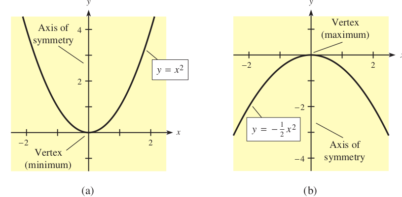
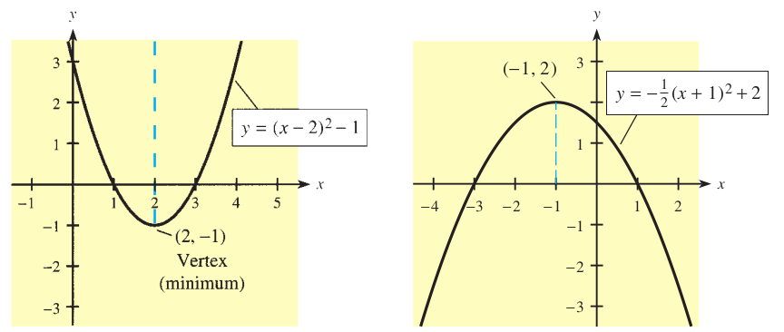

```{r setup, include=FALSE}
knitr::opts_chunk$set(echo = FALSE)
```

## Graphing: The Shape of Quadratic functions

When graphed, quadratic functions take the shape of a parabola. Note that unlike the quadratic equation ( which = 0), we equate the function to y. 

$ax^{2} + bx + c = 0$ for $a \neq 0$ is the general form of the quadratic equation.

$ax^{2} + bx + c = y$ for $a \neq 0$ is the general form of the quadratic function. The more common form is $y = ax^{2} + bx + c$

## Graphing: The Shape of Quadratic functions

- Quadratic functions take a U or n shape with symmetry along the x = a. 

- The maximum or minimum (depending on the shape is the vertex). 

- U-shaped quadratic functions have a minimum, while the n-shaped ones have a maximum. 

- The value of a in $y = ax^{2} + bx + c$, determines the shape of the graph of the quadratic function.

## Graphing: The Shape of Quadratic functions

- If a > 0, then we have a U-shaped graph, otherwise, we have an n-shaped graph. 

- The shape of the graph of a quadratic function is parabolic. See below. 

- In the examples below, the symmetry is along x = 0, the y-axis. 



## Graphing: The Shape of Quadratic functions

- In other cases, the line of symmetry can be different, but always a vertical line x = a for some constant a. See below. 



## The Shape of Quadratic functions: Maxima or Minima

- We can find the x-coordinate of the vertex of the graph of y 5 ax 2 1 bx 1 c by using the fact that the axis of symmetry of a parabola passes through the vertex. 

- Regardless of the location of the vertex of $y = ax^{2} + bx + c$ or the direction it opens, the y-intercept of the graph of $y = ax^{2} + bx + c$ is (0, c) and there is another point on the graph with y-coordinate c.

- In other words, the y-intercept of any quadratic function is the c in $y = ax^{2} + bx + c$

- Hence, to get the vertex, we can substitute y with c and solve the equation. 

## The Shape of Quadratic functions: Maxima or Minima

- $y = ax^{2} + bx + c$

- Substituting y = c

- $c = ax^{2} + bx + c$

- $0 = ax^{2} + bx$

- $0 = x(ax + b)$

- $x = 0$ or $x = \frac{-b}{a}$

- Remember the vertex represents the maximum or minimum. 


